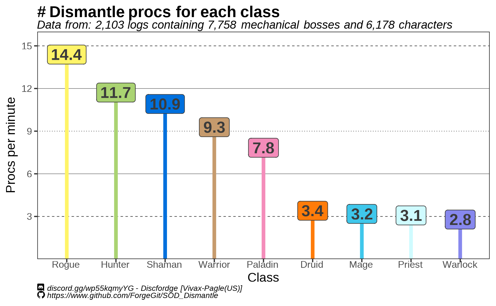

# Dismantle proc data for Season of Discovery 

_Vivax (Pagle-US) -_ `Discfordge` _(Discord)_

Quick data crawl i did on dismantle proc "rates".

I couldn't find significant differences on the damage dealt by the proc across different classes.

Unlike previous analysis I have done, I didn't rigorously filtered out "duplicated" log uploads. That said, I don't expect these to change the results or pattern seen.

The enchant has (allegedly) changed a couple times since its introduction on Phase 2 of World of Warcraft: Season of Discovery (February 8th, 2024)

However the main documented change in a bluepost has been:

- February 21, 2024:
        - "The Dismantle enchant now procs more often for casters and melee."

## Other analysis and random stuff

- If you have questions, you can contact me on discord: https://discord.gg/wp55kqmyYG (Discord: Discfordge)  

- Consider buying me a coffee? :) https://ko-fi.com/forge

- Or check other things I have done here: https://github.com/ForgeGit?tab=repositories
